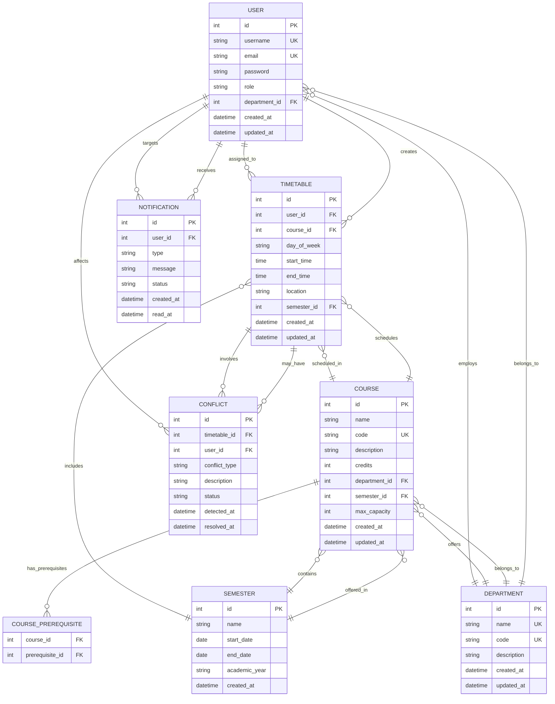

# TimeFlow Database Schema Documentation

## Overview
This document provides comprehensive details about the TimeFlow database schema, including entity relationships, table structures, indexes, and constraints.

## Entity Relationship Diagram



## Detailed Table Structures

### Users Table
```sql
CREATE TABLE users (
    id SERIAL PRIMARY KEY,
    username VARCHAR(50) UNIQUE NOT NULL,
    email VARCHAR(255) UNIQUE NOT NULL,
    password VARCHAR(255) NOT NULL,
    role VARCHAR(20) NOT NULL CHECK (role IN ('ADMIN', 'FACULTY', 'STUDENT')),
    department_id INTEGER REFERENCES departments(id),
    created_at TIMESTAMP DEFAULT CURRENT_TIMESTAMP,
    updated_at TIMESTAMP DEFAULT CURRENT_TIMESTAMP,
    
    -- Indexes
    INDEX idx_users_username (username),
    INDEX idx_users_email (email),
    INDEX idx_users_department (department_id),
    INDEX idx_users_role (role)
);
```

### Departments Table
```sql
CREATE TABLE departments (
    id SERIAL PRIMARY KEY,
    name VARCHAR(100) UNIQUE NOT NULL,
    code VARCHAR(10) UNIQUE NOT NULL,
    description TEXT,
    created_at TIMESTAMP DEFAULT CURRENT_TIMESTAMP,
    updated_at TIMESTAMP DEFAULT CURRENT_TIMESTAMP,
    
    -- Indexes
    INDEX idx_departments_name (name),
    INDEX idx_departments_code (code)
);
```

### Semesters Table
```sql
CREATE TABLE semesters (
    id SERIAL PRIMARY KEY,
    name VARCHAR(50) NOT NULL,
    start_date DATE NOT NULL,
    end_date DATE NOT NULL,
    academic_year VARCHAR(9) NOT NULL,
    created_at TIMESTAMP DEFAULT CURRENT_TIMESTAMP,
    
    -- Constraints
    CHECK (end_date > start_date),
    
    -- Indexes
    INDEX idx_semesters_name (name),
    INDEX idx_semesters_dates (start_date, end_date),
    INDEX idx_semesters_academic_year (academic_year)
);
```

### Courses Table
```sql
CREATE TABLE courses (
    id SERIAL PRIMARY KEY,
    name VARCHAR(255) NOT NULL,
    code VARCHAR(20) UNIQUE NOT NULL,
    description TEXT,
    credits INTEGER NOT NULL CHECK (credits > 0 AND credits <= 6),
    department_id INTEGER NOT NULL REFERENCES departments(id),
    semester_id INTEGER REFERENCES semesters(id),
    max_capacity INTEGER DEFAULT 50,
    created_at TIMESTAMP DEFAULT CURRENT_TIMESTAMP,
    updated_at TIMESTAMP DEFAULT CURRENT_TIMESTAMP,
    
    -- Indexes
    INDEX idx_courses_code (code),
    INDEX idx_courses_department (department_id),
    INDEX idx_courses_semester (semester_id),
    INDEX idx_courses_name (name),
    FULLTEXT INDEX idx_courses_search (name, description)
);
```

### Timetables Table
```sql
CREATE TABLE timetables (
    id SERIAL PRIMARY KEY,
    user_id INTEGER NOT NULL REFERENCES users(id),
    course_id INTEGER NOT NULL REFERENCES courses(id),
    day_of_week VARCHAR(10) NOT NULL CHECK (day_of_week IN ('MONDAY', 'TUESDAY', 'WEDNESDAY', 'THURSDAY', 'FRIDAY', 'SATURDAY', 'SUNDAY')),
    start_time TIME NOT NULL,
    end_time TIME NOT NULL,
    location VARCHAR(100),
    semester_id INTEGER NOT NULL REFERENCES semesters(id),
    created_at TIMESTAMP DEFAULT CURRENT_TIMESTAMP,
    updated_at TIMESTAMP DEFAULT CURRENT_TIMESTAMP,
    
    -- Constraints
    CHECK (end_time > start_time),
    UNIQUE (user_id, course_id, day_of_week, start_time, end_time, semester_id),
    
    -- Indexes
    INDEX idx_timetables_user (user_id),
    INDEX idx_timetables_course (course_id),
    INDEX idx_timetables_semester (semester_id),
    INDEX idx_timetables_day (day_of_week),
    INDEX idx_timetables_time (start_time, end_time),
    INDEX idx_timetables_location (location)
);
```

### Conflicts Table
```sql
CREATE TABLE conflicts (
    id SERIAL PRIMARY KEY,
    timetable_id INTEGER NOT NULL REFERENCES timetables(id),
    user_id INTEGER NOT NULL REFERENCES users(id),
    conflict_type VARCHAR(50) NOT NULL CHECK (conflict_type IN ('TIME_CONFLICT', 'ROOM_CONFLICT', 'INSTRUCTOR_CONFLICT', 'STUDENT_CONFLICT')),
    description TEXT,
    status VARCHAR(20) DEFAULT 'PENDING' CHECK (status IN ('PENDING', 'RESOLVED', 'IGNORED')),
    detected_at TIMESTAMP DEFAULT CURRENT_TIMESTAMP,
    resolved_at TIMESTAMP,
    
    -- Indexes
    INDEX idx_conflicts_timetable (timetable_id),
    INDEX idx_conflicts_user (user_id),
    INDEX idx_conflicts_type (conflict_type),
    INDEX idx_conflicts_status (status),
    INDEX idx_conflicts_detected (detected_at)
);
```

### Notifications Table
```sql
CREATE TABLE notifications (
    id SERIAL PRIMARY KEY,
    user_id INTEGER NOT NULL REFERENCES users(id),
    type VARCHAR(50) NOT NULL,
    message TEXT NOT NULL,
    status VARCHAR(20) DEFAULT 'UNREAD' CHECK (status IN ('UNREAD', 'READ', 'ARCHIVED')),
    created_at TIMESTAMP DEFAULT CURRENT_TIMESTAMP,
    read_at TIMESTAMP,
    
    -- Indexes
    INDEX idx_notifications_user (user_id),
    INDEX idx_notifications_type (type),
    INDEX idx_notifications_status (status),
    INDEX idx_notifications_created (created_at)
);
```

### Course Prerequisites Table
```sql
CREATE TABLE course_prerequisites (
    course_id INTEGER NOT NULL REFERENCES courses(id),
    prerequisite_id INTEGER NOT NULL REFERENCES courses(id),
    PRIMARY KEY (course_id, prerequisite_id),
    
    -- Indexes
    INDEX idx_prerequisites_course (course_id),
    INDEX idx_prerequisites_prerequisite (prerequisite_id)
);
```

## Indexes and Performance Optimization

### Composite Indexes
```sql
-- For timetable conflict detection
CREATE INDEX idx_timetable_conflict_check ON timetables(user_id, day_of_week, start_time, end_time, semester_id);

-- For course search
CREATE INDEX idx_course_search ON courses(name, code);

-- For user course enrollment
CREATE INDEX idx_user_courses ON timetables(user_id, course_id, semester_id);

-- For room availability
CREATE INDEX idx_room_schedule ON timetables(location, day_of_week, start_time, end_time, semester_id);
```

### Full-Text Search Indexes
```sql
-- For course search functionality
CREATE FULLTEXT INDEX idx_courses_ft_search ON courses(name, description);

-- For department search
CREATE FULLTEXT INDEX idx_departments_ft_search ON departments(name, description);
```

## Constraints and Validation

### Referential Integrity
- All foreign keys are properly indexed for performance
- Cascade delete rules prevent orphaned records
- Check constraints ensure data validity

### Business Rules
```sql
-- Ensure no overlapping schedules for same user
CREATE TRIGGER prevent_schedule_overlap
BEFORE INSERT ON timetables
FOR EACH ROW
BEGIN
    IF EXISTS (
        SELECT 1 FROM timetables
        WHERE user_id = NEW.user_id
        AND day_of_week = NEW.day_of_week
        AND semester_id = NEW.semester_id
        AND (
            (start_time <= NEW.start_time AND end_time > NEW.start_time)
            OR (start_time < NEW.end_time AND end_time >= NEW.end_time)
            OR (start_time >= NEW.start_time AND end_time <= NEW.end_time)
        )
    ) THEN
        SIGNAL SQLSTATE '45000' SET MESSAGE_TEXT = 'Schedule overlap detected';
    END IF;
END;
```

## Data Types and Constraints

### Enumerated Types
```sql
CREATE TYPE user_role AS ENUM ('ADMIN', 'FACULTY', 'STUDENT');
CREATE TYPE conflict_status AS ENUM ('PENDING', 'RESOLVED', 'IGNORED');
CREATE TYPE notification_status AS ENUM ('UNREAD', 'READ', 'ARCHIVED');
CREATE TYPE day_of_week AS ENUM ('MONDAY', 'TUESDAY', 'WEDNESDAY', 'THURSDAY', 'FRIDAY', 'SATURDAY', 'SUNDAY');
```

### Time Zone Handling
```sql
-- All timestamps are stored in UTC
ALTER TABLE users ALTER COLUMN created_at TYPE TIMESTAMP WITH TIME ZONE;
ALTER TABLE users ALTER COLUMN updated_at TYPE TIMESTAMP WITH TIME ZONE;
```

## Database Views

### User Schedule View
```sql
CREATE VIEW user_schedule AS
SELECT 
    u.id as user_id,
    u.username,
    c.name as course_name,
    c.code as course_code,
    t.day_of_week,
    t.start_time,
    t.end_time,
    t.location,
    s.name as semester_name
FROM users u
JOIN timetables t ON u.id = t.user_id
JOIN courses c ON t.course_id = c.id
JOIN semesters s ON t.semester_id = s.id;
```

### Course Enrollment View
```sql
CREATE VIEW course_enrollment AS
SELECT 
    c.id as course_id,
    c.name as course_name,
    c.code as course_code,
    d.name as department_name,
    s.name as semester_name,
    COUNT(t.id) as enrolled_students,
    c.max_capacity
FROM courses c
JOIN departments d ON c.department_id = d.id
JOIN semesters s ON c.semester_id = s.id
LEFT JOIN timetables t ON c.id = t.course_id
GROUP BY c.id, c.name, c.code, d.name, s.name, c.max_capacity;
```

### Conflict Summary View
```sql
CREATE VIEW conflict_summary AS
SELECT 
    c.conflict_type,
    COUNT(*) as total_conflicts,
    COUNT(CASE WHEN c.status = 'RESOLVED' THEN 1 END) as resolved_conflicts,
    COUNT(CASE WHEN c.status = 'PENDING' THEN 1 END) as pending_conflicts
FROM conflicts c
GROUP BY c.conflict_type;
```

## Backup and Recovery

### Automated Backup Script
```bash
#!/bin/bash
# backup.sh - Daily database backup

BACKUP_DIR="/backups/timeflow"
DATE=$(date +%Y%m%d_%H%M%S)

# Create backup directory
mkdir -p $BACKUP_DIR

# Full database backup
pg_dump -h localhost -U timeflow_user -d timeflow_db > $BACKUP_DIR/timeflow_backup_$DATE.sql

# Compress backup
gzip $BACKUP_DIR/timeflow_backup_$DATE.sql

# Retain only last 30 days
find $BACKUP_DIR -name "timeflow_backup_*.sql.gz" -mtime +30 -delete
```

### Point-in-Time Recovery
```sql
-- Create WAL archive
archive_mode = on
archive_command = 'cp %p /archive/wal/%f'
```

## Monitoring and Maintenance

### Performance Monitoring Queries
```sql
-- Table size analysis
SELECT 
    schemaname,
    tablename,
    pg_size_pretty(pg_total_relation_size(schemaname||'.'||tablename)) as size
FROM pg_tables
WHERE schemaname NOT IN ('information_schema', 'pg_catalog')
ORDER BY pg_total_relation_size(schemaname||'.'||tablename) DESC;

-- Index usage statistics
SELECT 
    schemaname,
    tablename,
    indexname,
    idx_scan,
    idx_tup_read,
    idx_tup_fetch
FROM pg_stat_user_indexes
ORDER BY idx_scan DESC;

-- Slow query analysis
SELECT 
    query,
    calls,
    total_time,
    mean_time
FROM pg_stat_statements
ORDER BY total_time DESC
LIMIT 10;
```

### Maintenance Schedule
```sql
-- Weekly maintenance
VACUUM ANALYZE;

-- Monthly maintenance
REINDEX DATABASE timeflow_db;

-- Quarterly maintenance
CLUSTER timetables USING idx_timetables_user;
```

## Security Considerations

### Row-Level Security
```sql
-- Enable RLS on sensitive tables
ALTER TABLE timetables ENABLE ROW LEVEL SECURITY;

-- Create policy for user access
CREATE POLICY user_timetable_policy ON timetables
FOR ALL TO application_user
USING (user_id = current_setting('app.current_user_id')::INTEGER);
```

### Encryption
```sql
-- Encrypt sensitive columns
CREATE EXTENSION IF NOT EXISTS pgcrypto;

-- Example: Encrypt email addresses
ALTER TABLE users ADD COLUMN email_encrypted BYTEA;
UPDATE users SET email_encrypted = pgp_sym_encrypt(email, 'encryption_key');
```

## Migration Scripts

### Version 1.0 to 1.1 Migration
```sql
-- Add new columns
ALTER TABLE users ADD COLUMN last_login TIMESTAMP;
ALTER TABLE courses ADD COLUMN syllabus_url VARCHAR(500);

-- Create new indexes
CREATE INDEX idx_users_last_login ON users(last_login);
CREATE INDEX idx_courses_syllabus ON courses(syllabus_url);

-- Update existing data
UPDATE users SET last_login = created_at WHERE last_login IS NULL;
```

### Data Validation Rules
```sql
-- Ensure email uniqueness
CREATE UNIQUE INDEX idx_users_email_unique ON users(email);

-- Ensure course code uniqueness per department
CREATE UNIQUE INDEX idx_courses_code_department ON courses(code, department_id);

-- Ensure no duplicate enrollments
CREATE UNIQUE INDEX idx_timetables_unique_enrollment ON timetables(user_id, course_id, semester_id);
```

## Troubleshooting Guide

### Common Issues and Solutions

#### Connection Pool Exhaustion
```sql
-- Check connection count
SELECT count(*) FROM pg_stat_activity;

-- Increase connection limit
ALTER SYSTEM SET max_connections = 200;
SELECT pg_reload_conf();
```

#### Lock Contention
```sql
-- Identify blocking queries
SELECT 
    blocked_locks.pid AS blocked_pid,
    blocked_activity.usename AS blocked_user,
    blocking_locks.pid AS blocking_pid,
    blocking_activity.usename AS blocking_user,
    blocked_activity.query AS blocked_statement,
    blocking_activity.query AS blocking_statement
FROM pg_catalog.pg_locks blocked_locks
JOIN pg_catalog.pg_activity blocked_activity ON blocked_activity.pid = blocked_locks.pid
JOIN pg_catalog.pg_locks blocking_locks ON blocking_locks.locktype = blocked_locks.locktype
JOIN pg_catalog.pg_activity blocking_activity ON blocking_activity.pid = blocking_locks.pid
WHERE NOT blocked_locks.granted;
```

#### Performance Tuning
```sql
-- Check configuration
SELECT name, setting, unit, context 
FROM pg_settings 
WHERE name LIKE '%memory%' OR name LIKE '%cache%' OR name LIKE '%work_mem%';

-- Update configuration
ALTER SYSTEM SET shared_buffers = '256MB';
ALTER SYSTEM SET effective_cache_size = '1GB';
ALTER SYSTEM SET work_mem = '4MB';
SELECT pg_reload_conf();
```

## Development Database Setup

### Docker Compose Configuration
```yaml
version: '3.8'
services:
  postgres:
    image: postgres:13
    environment:
      POSTGRES_DB: timeflow_db
      POSTGRES_USER: timeflow_user
      POSTGRES_PASSWORD: admin
    ports:
      - "5432:5432"
    volumes:
      - postgres_data:/var/lib/postgresql/data
      - ./init.sql:/docker-entrypoint-initdb.d/init.sql

volumes:
  postgres_data:
```

### Sample Data Generation
```sql
-- Insert sample departments
INSERT INTO departments (name, code, description) VALUES
('Computer Science', 'CS', 'Department of Computer Science'),
('Mathematics', 'MATH', 'Department of Mathematics'),
('Physics', 'PHYS', 'Department of Physics');

-- Insert sample semesters
INSERT INTO semesters (name, start_date, end_date, academic_year) VALUES
('Fall 2024', '2024-08-15', '2024-12-15', '2024-2025'),
('Spring 2025', '2025-01-15', '2025-05-15', '2024-2025');

-- Insert sample users
INSERT INTO users (username, email, password, role, department_id) VALUES
('admin', 'admin@university.edu', '$2a$10$encrypted_password', 'ADMIN', 1),
('john_doe', 'john@university.edu', '$2a$10$encrypted_password', 'FACULTY', 1);
```

This comprehensive database schema provides a robust foundation for the TimeFlow timetable management system with proper indexing, constraints, and performance optimizations.
